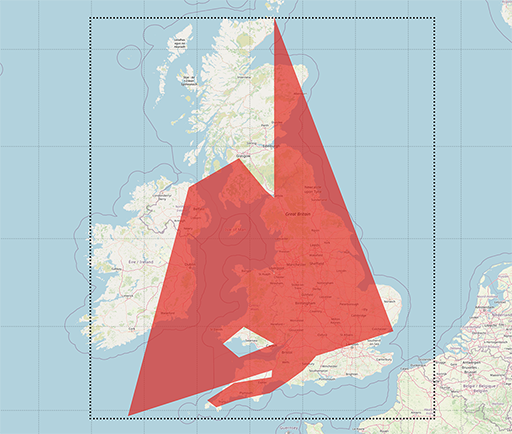
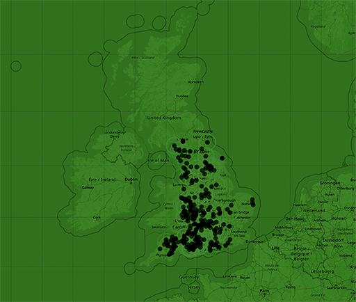

# flood-watch-map
Map making use of the OpenLayers library for use on the [Flood Watch web app](https://github.com/Sam010000101/flood-watch). 

Data is sourced from the [Environment Agency (EA) Real Time flood-monitoring API](https://environment.data.gov.uk/flood-monitoring/doc/reference) via jQuery AJAX calls. The returned positional data is fed into an [OpenLayers](https://openlayers.org/) map featuring an [Open Street Map](https://www.openstreetmap.org/) tile layer and appears as marker dots. The map can be zoomed and updated, allowing dynamic flood data to be displayed in response to user input.

## Challenges
The floods endpoint of the EA API does not directly return geographical coordinates. These are available via API links included in the response, but retrieving coordinates from each of these proved to be a considerabe bottle neck. In order to improve loading times, the flood area coordinate data was [retrieved](https://github.com/paulashby/flood-watch-map/blob/main/flood-map/flood-areas.js) and [stored locally](https://github.com/paulashby/flood-watch-map/blob/main/flood-map/data/flood-areas.js). This proved to be a successful strategy, and allowed complete control over the rate at which individual markers were added.

A further challenge arose due to the requirement that the OpenLayers map should work as a full-page element. Framing the UK so it remained clear of the surrounding page elements was a tricky problem. Fortunately, the [OpenLayers API](https://openlayers.org/en/latest/apidoc/) provides a [fit](https://openlayers.org/en/latest/apidoc/module-ol_View-View.html#fit) method that allows a polygon to be framed in the view. This accepts padding values which determine the offset of the polygon from the edge of the view. A hidden HTML element was added to the page purely to provide these padding values, and ChatGPT provided a highly optimised [geojson object](https://github.com/paulashby/flood-watch-map/blob/main/flood-map/data/geojson/uk.geojson) of approximate UK bounds as a source for the polygon. This worked very nicely, with the scale and position of the UK portion of the map exactly matching that of the responsive HTML element. 

<figcaption>

*The image above is an illustration of how this works: the dotted rectangle is the HTML element. The geojason polygon of the UK is coloured red. Both these elements are hidden in practice and are used only to position the map. Notice how the polygon is scaled and positioned to fit within the HTML element, and the corresponding map area (the UK) respects the position of the polygon.*

</figcaption>

## Usage
Visit the [deployed Flood Watch app](https://sam010000101.github.io/flood-watch/) to see the map in action. Enter a location to zoom, clear the search field to revert the view, Use the provided buttons to filter by severity.

<figcaption>

*The colourised map as it appears in the [app](https://sam010000101.github.io/flood-watch/).*

</figcaption>

## Credits
Thanks to the following:
[the Trilogy Skills Bootcamp in Front-End Web Development](https://skillsforlife.edx.org/coding/frontend/landing/?s=Google-Unbranded&pkw=web%20design%20training&pcrid=624628533241&pmt=p&utm_source=google&utm_medium=cpc&utm_campaign=GGL%7CSKILLS-FOR-LIFE%7CSEM%7CCODING%7C-%7COFL%7CTIER-1%7CALL%7CNBD-G%7CBMM%7CPrimary%7CSubject-Matter&utm_term=web%20design%20training&s=google&k=web%20design%20training&utm_adgroupid=140443158663&utm_locationphysicalms=1006886&utm_matchtype=p&utm_network=g&utm_device=c&utm_content=624628533241&utm_placement=&gclid=Cj0KCQjwqc6aBhC4ARIsAN06NmMdwBRSe3BLeaChkukN5Bbqb18220k1ku9TB2o9tzsX0xYUc-dlRWgaAuyvEALw_wcB&gclsrc=aw.ds) for giving us the opportunity to work together as a team. Thanks also to Philip Howley, the course Instructor and Brooke Love, my personal teaching assistant.

All [contributors](https://github.com/openlayers/openlayers/graphs/contributors) to the [OpenLayers library](https://github.com/openlayers/openlayers). (Please see [license](https://www.tldrlegal.com/l/freebsd)).

The [Environment Agency (EA) Real Time flood-monitoring API](https://environment.data.gov.uk/flood-monitoring/doc/reference). This uses Environment Agency flood and river level data from the real-time data API (Beta). (Please see [license](https://www.nationalarchives.gov.uk/doc/open-government-licence/version/3/)).

OpenStreetMap® is open data, licensed under the [Open Data Commons Open Database License](https://opendatacommons.org/licenses/odbl/) (ODbL) by the [OpenStreetMap Foundation](https://osmfoundation.org/) (OSMF).

## Contributors to the [Flood Watch web app](https://github.com/Sam010000101/flood-watch) itself:
* Sam Brooke
* Damien Nsoh Ayine
* Dayo Adekunle
